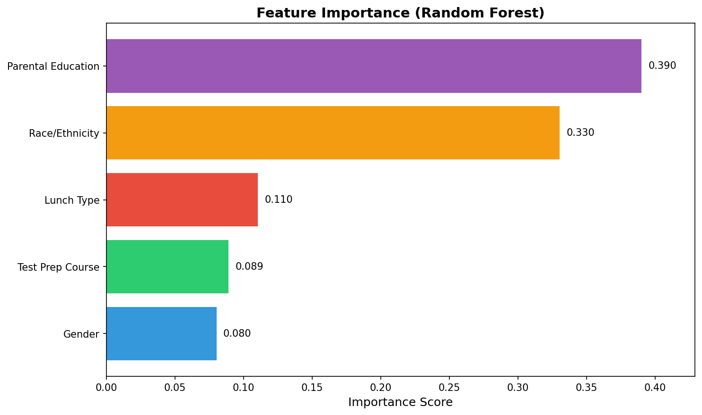
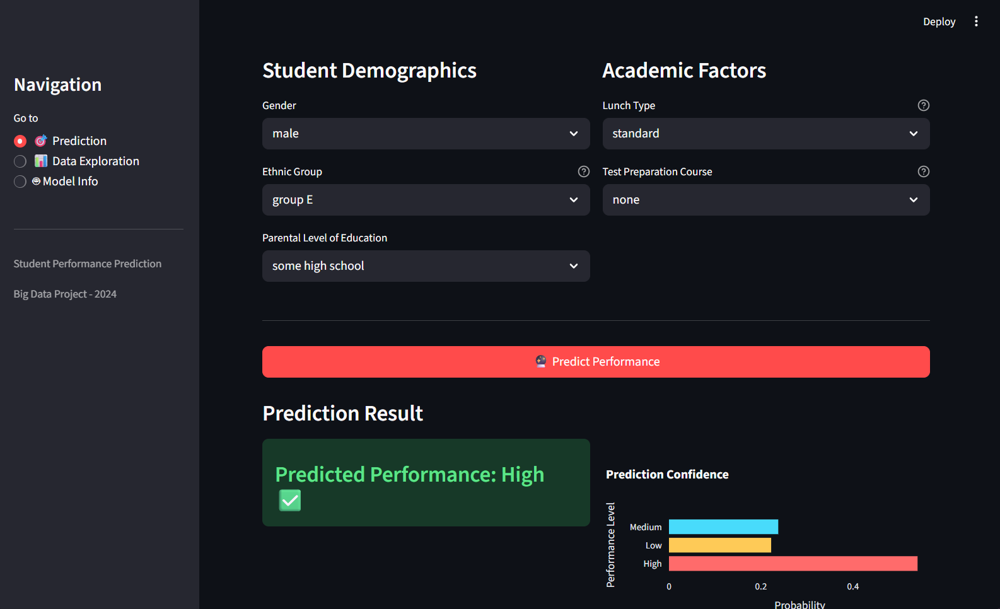

# Student Performance Prediction
## Using Apache Spark & Machine Learning

---

# Problem Statement

### The Challenge
- Teachers can't monitor every student
- Hard to identify **at-risk students** early

### Our Solution
- Predicts performance BEFORE exams
- Enables **early intervention**

---

# Dataset Overview

**Source:** Kaggle - Students Performance in Exams

| Metric | Value |
|--------|-------|
| Records | 1,000 students |
| Features | 8 |

### Key Features
`gender` · `race/ethnicity` · `parental level of education`
`lunch` · `test preparation course` · `math/reading/writing scores`

---

<!-- # Data Cleaning

### Problems Found
- No missing values in this dataset
- No duplicate rows
- Scores within valid 0-100 range

### Validation Performed

| Check | Result |
|-------|--------|
| Missing Values | 0 per column |
| Duplicates | 0 rows |
| Score Range | Valid (0-100) |

--- -->

# Target Variable Created

### Performance Level (based on average score)

| Level | Condition | Count |
|-------|-----------|-------|
| **High** | Average ≥ 80 | 198 |
| **Medium** | Average 60-79 | 517 |
| **Low** | Average < 60 | 285 |

---

# Exploratory Data Analysis

### Summary Statistics

| Metric | Value |
|--------|-------|
| Avg Math Score | 66.09 |
| Avg Reading Score | 69.17 |
| Avg Writing Score | 68.05 |

### Key Findings
- Strong correlation between all test scores (r > 0.8)
- **Test preparation** improves performance
- **Standard lunch** associated with higher scores

---

# Data Preparation

### Encoding
- Gender: female/male → indexed
- Race/Ethnicity: group A-E → one-hot encoded
- Parental Education: 6 levels → one-hot encoded
- Lunch: standard/free-reduced → one-hot encoded
- Test Prep: none/completed → one-hot encoded

### Other Steps
- **Scaling:** StandardScaler on numerical features
- **Split:** 80% train / 20% test

---

# Machine Learning Models

| Model | Pros | Cons |
|-------|------|------|
| **Logistic Regression** | Fast, good baseline | Less flexible |
| **Random Forest** | Better for complex patterns | Slower |

---

# Model Evaluation

### Metrics

| Metric | Description |
|--------|-------------|
| Accuracy | Overall correct predictions |
| F1-Score | Balance of precision & recall |

### Results

| Model | Accuracy | F1-Score |
|-------|----------|----------|
| Logistic Regression | 98.8% | 98.8% |
| Random Forest | 93.2% | 93.2% |

---

# Feature Importance

### Top Predictive Features

1. **Parental Education Level** (39.0%)
2. **Race/Ethnicity** (33.0%)
3. **Lunch Type** (11.0%)
4. **Test Prep Course** (8.9%)
5. **Gender** (8.0%)

---

<!-- _class: invert -->

---

# Streamlit Web App

---

<!-- _class: invert -->

---

# Thank You!

## Questions?

**Team:** Melissia · Nadine · Bassant · Makady

**GitHub:** https://github.com/Melissiasamir/student-performance-prediction-spark
